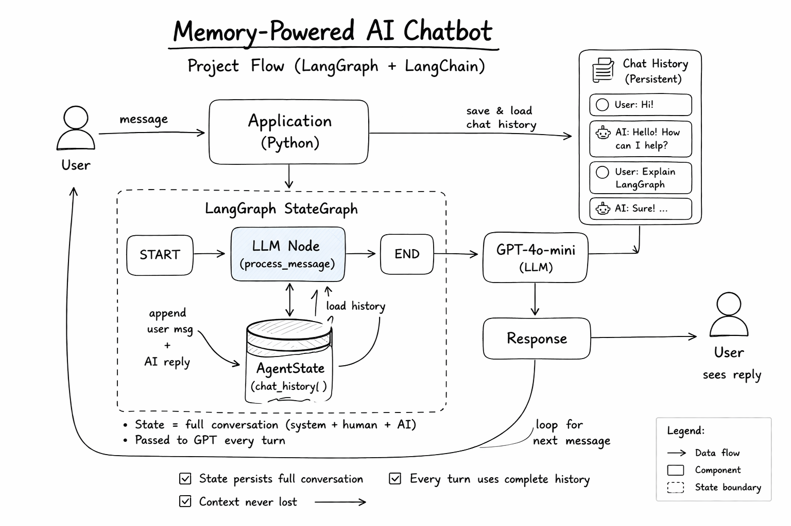

# Memory-Powered AI Chatbot

This project is a production-style chatbot built with LangGraph, LangChain, FastAPI, and SQLite-backed persistent memory. Every request loads the stored history for a `session_id`, appends the new user message, invokes `gpt-4o-mini` with the full conversation context, persists the updated turn, and returns the assistant reply.

## System Architecture




The request flow is:

1. Client sends `session_id` and `message`.
2. FastAPI receives the request in `app/main.py`.
3. The LangGraph `StateGraph` invokes the single node `process_message`.
4. `process_message` loads full chat history from SQLite.
5. If this is the first turn, it stores a system prompt.
6. The new human message is appended to the full history.
7. `gpt-4o-mini` receives the complete message list.
8. The AI reply is appended and saved back to SQLite.
9. The response and full updated history are returned.

## Project Structure

```text
app/
  __init__.py
  config.py
  graph.py
  llm.py
  main.py
  memory.py
  schemas.py
  state.py
tests/
  test_graph.py
  test_memory.py
main.py
README.md
.env.example
requirement.txt
```

## Setup

```bash
python3 -m venv .venv
. .venv/bin/activate
pip install -r requirement.txt
cp .env.example .env
```

Set `OPENAI_API_KEY` in `.env`.

## Run The API

```bash
. .venv/bin/activate
python main.py
```

The API starts on `http://127.0.0.1:8000`.

## Example Request

```bash
curl -X POST http://127.0.0.1:8000/chat \
  -H "Content-Type: application/json" \
  -d '{
    "session_id": "user-123",
    "message": "Hi, my name is Hasib."
  }'
```

Second turn using the same session:

```bash
curl -X POST http://127.0.0.1:8000/chat \
  -H "Content-Type: application/json" \
  -d '{
    "session_id": "user-123",
    "message": "What is my name?"
  }'
```

Because the second request reuses the same `session_id`, the graph reloads the earlier messages from SQLite and sends the full conversation history to the model again.

## Memory Across Turns

Example history for `session_id=user-123`:

Turn 1:
- System: persistent chatbot instructions
- Human: "Hi, my name is Hasib."
- AI: "Hi Hasib, nice to meet you."

Turn 2:
- System: persistent chatbot instructions
- Human: "Hi, my name is Hasib."
- AI: "Hi Hasib, nice to meet you."
- Human: "What is my name?"
- AI: "Your name is Hasib."

Turn 3:
- The full five prior messages are loaded again before generating the next answer.

## Run Tests

```bash
. .venv/bin/activate
pytest
```

## Persistence Details

- Chat history is stored in SQLite at `data/chat_memory.db` by default.
- Messages are saved with `session_id`, `role`, `content`, and timestamp.
- Each new request loads all prior messages ordered by insertion order.
- The app persists system, human, and AI messages so future turns use complete context.

## Extending Later

- Add tools by expanding the graph with tool nodes and routing edges.
- Add retrieval by loading external documents before the LLM node.
- Support multi-user tenancy by using authenticated user IDs instead of free-form session IDs.
- Replace SQLite with PostgreSQL by swapping the storage implementation behind the same memory interface.
